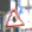
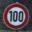
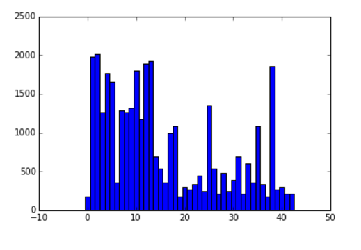
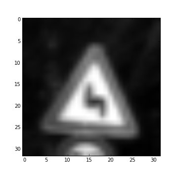
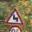

## <b>Udacity Self-Driving Nanodegree 

## Traffic Sign Recognition
======================================================================

### Build a Traffic Sign Recognition Project

> **The Steps in the Project are as following :**

> - Load the training, test and validation data from the picked file provided in the project.
> - Visualize and explore the dataset.
> - Preprocess the data set - shuffle the data set, convert images to grayscale and normalize.
> - Train the training data set on a model architecture - LeNet architecture has been used here.
> - Validate the model architecture on the validation set. 
> - Test the output of the model architecture on the test set.
> - Use the model to make predictions on new images.
> - Analyze the softmax probabilities of the new images.
> - Summarize the results with a written report.

#### <b>Data Set Summary & Exploration </b>

The data set for this project is available as pickled files. There are three sets of pickled files provided- one for each of training, testing and validation. These picked files are loaded and information about the dataset is extracted from them. This is done is <b> cell 2 and 3 </b> of the Python notebook.
>*  The length of the training data set = 34799
>* The length of the testing example = 12630
>* The shape of each image in the data set = 32x32x3 
>* The number of unique classes in the dataset = 43

#### <b>Data Set Visualisation</b>
Some of the test images as available in the data set can be seen below :  
 
 
      

In addition to this the count of each sign is calculated using the unique function available in Python and numpy and plotted using matlab functions.

 
#### <b> Preprocessing the dataset </b>

##### <b>Shuffling the images</b> - As a first step, the dataset is shuffled to ensure that there is good mix of different kinds of images in each batch run. This was done because without shuffling when the images from the training set was printed, it was seen that bunch of similar images occurred together in the dataset.

##### <b> Grayscaling the images</b> -  Each image in the dataset is a colored image. Thus images were converted to grayscale to ensure that the network has to operate on one channel instead of three channels. The formula for luminosity was used to grayscale the images as this provided a better estimate than simply averaging the RGB values.
An example of an image before and after grayscaling is seen below:  
 

 

##### <b>Normalization</b> - This was done as suggested in one of the lectures in tensor flow to maintain numerical stability. Initially I did not choose to normalize but using normalization improved the validation accuracy. 

The above pre processing steps were done for each of training, testing and validation dataset.

#### <b> Model Architecture </b>

My network is a convolutional neural network, as these tend to do very well with images. I mostly used the same architecture as the LeNet neural network did, with 2 convolutional layers and 3 fully connected layers. The convolutional neural network is defined in the 10th cell of the IPython notebook.

Grayscaling changed the input data to 32x32 from 32x32x3 and hence I had to reshape the input array so that it could be 32x32x1.
I initially used an epoch of value 10 with a batch size of 128. However, experimenting with different batch size between 100 to 250 I found a reasonable accuracy with a batch size of 160.

Changing the epoch from 10 to 20 did not provide any improvement in accuracy. However, using a significantly larger epoch like 40 provided a better convergence.

For the model hyperparameters, a mean of 0 and standard deviation/sigma of 0.1 was taken. These hyperparameters attempt to keep a mean of 0 and equal variance.
I utilized the AdamOptimizer from within TensorFLow to optimize, which seemed to do better than a regular Gradient Descent Optimizer

			Layer    | Description
			-------- | ------------
			Input    | 32x32x32
	  Convolution    | 1x1 stride,padding="VALID",output = 28x28x6
		    RELU     | 
	    Max Pooling  | 2x2 stride, output = 14x14x6
	    Convolution  | 1x1 stride,padding="VALID",output = 10x10x16
	        RELU     | 
	    Max Pooling  | 2x2 stride, output = 5x5x16
	       Flatten   | output = 400
	FullyConnected   | input = 400, output = 120
			RELU     |
	FullyConnected   | input = 120, output = 84
			RELU     |
	FullyConnected   | input = 84, output (Logits) = 43	      

> **Note:** I did not split the training data into training and validation sets as the validation data that was provided gave reasonable accuracy results.

##### <b> My final model results were : </b>
Validation Accuracy = 94.2%
Testing accuracy = 91.2%

#### <b> Testing model on new images </b>

Five German traffic signs were downloaded from the internet and ran using our network. The five images are as follows:

    

The five images I have added are: 
1: Cross sign
2: Pedestrian sign
3: 50 Speed Limit
4: Stop Sign 
5: Yield sign.

The accuracy result is 20%. One reason for low accuracy result is that since my network accepts an input of size 32x32x3 , I had to resize the image to 32x32 which also effected the aspect ratio.

From the soft max probability, the cross sign is detected incorrectly because it assumes its a speed limit sign which I assume is due to its shape.

